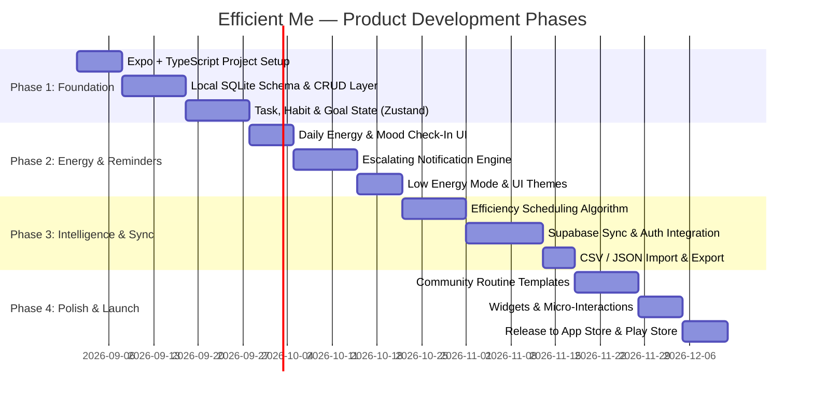

# Efficient Me — Product Specification & Concept Blueprint

> **Tagline**: The energy-aware, mental-health-first productivity engine that adapts tasks and habits to *how you actually feel*.

---

## 1. Executive Summary & Vision

Traditional productivity tools (Todoist, TickTick, Notion) treat humans like linear machines: they expect 100% capacity every day at scheduled hours, leading to guilt, shame spirals, and app abandonment when energy or mental health dips.

**Efficient Me** is a cross-platform mobile app (Android & iOS) designed to bridge the gap between **high-performance productivity** and **mental well-being**. By combining task/habit management with daily energy level tracking, mood logging, and an intelligent adaptive scheduling algorithm, the app dynamically adjusts workload, delivers smart escalating reminders, and guides users to peak efficiency without burnout.

---

## 2. Core Value Pillars & Target Audience

| Pillar | Description |
| :--- | :--- |
| **⚡ Energy-Responsive** | Tasks and habits adapt to your daily energy curve (Morning Lark vs. Night Owl) and real-time fatigue levels. |
| **🧠 Mental-Health-First** | Low-energy days trigger gentle routines ("Low Energy Mode") instead of broken streaks and overwhelming backlogs. |
| **🔔 Persistent & Adaptive Alerts** | Smart reminder profiles (e.g., escalating vibration-only birthday alerts, recurring chore cadences) that make forgetfulness impossible. |
| **🌐 Offline-First & Private** | Zero latency, full offline functionality with multi-device sync and complete data portability (CSV/JSON/ICS). |

### Target Personas
1. **The Knowledge Worker / Student**: Needs deep work blocks during peak cognitive hours and wants automated task scheduling.
2. **The Burnout Recoverer / Self-Care Seeker**: Wants to build consistent habits without high-pressure guilt trips.
3. **The Neurodivergent / ADHD User**: Needs high-context, persistent yet non-jarring reminders (silent vibration escalation, visual clarity, low-friction entry).

---

## 3. Feature Breakdown & Specifications

### 3.1 Energy & Mental Health Tracking Engine
- **Daily Energy & Mood Check-In**:
  - Quick 5-second check-in upon first opening (or via morning notification).
  - Multi-dimensional rating: **Energy (1-5 ⚡)**, **Mood (1-5 😊)**, and optional contextual tags (*Sleep quality, Stress, Physical health, Focus*).
- **Energy-Task Matching Matrix**:
  - Every task/habit can be tagged with an energy requirement: **High Energy (Deep Work / Heavy Workout)**, **Medium Energy (Admin / Errands)**, or **Low Energy (Quick Wins / Gentle Stretch / Rest)**.
  - When the user logs low energy, the app dynamically surfaces Low Energy tasks and offers to reschedule demanding deadlines.
- **"Low Energy / Rest Mode"**:
  - A 1-tap toggle that pauses streak penalties, shifts demanding tasks to upcoming high-energy days, and recommends gentle restorative habits.

---

### 3.2 Unified Task, Habit & Goal Ecosystem
- **Interconnected Hierarchy**:
  - **Goals (Long-Term / OKRs)** $\rightarrow$ Broken down into **Milestones** $\rightarrow$ Driven by **Habits & Tasks**.
- **Task Management**:
  - CRUD operations, subtasks, priorities (P1-P4), tags, deadline dates, and estimated durations.
  - Energy-based filtering: "Show me tasks I can do right now with my 2/5 energy".
- **Habit Tracking (Elastic Habits)**:
  - Daily, weekly (e.g., 3x/week), or custom interval habits.
  - **Elastic Tiers** (Mini / Standard / Plus):
    - *Example*: Reading Habit $\rightarrow$ Mini: 2 pages (Low Energy) | Standard: 15 pages | Plus: 30 pages (High Energy).
  - Streak tracking with built-in "Freeze Days" / Grace periods to prevent demotivation.
- **Goal Tracking**:
  - Visual progress bars connected directly to completed sub-tasks and habit consistency.

---

### 3.3 Smart Notification & Escalating Reminder System

```
[Predefined Smart Reminder Profiles]
 ├── 1. Critical / Can't Forget (e.g., Family Birthday, Medicine, Flight)
 │     ├── T-24h (11:11 PM night before): Subtle Heads-up Notification
 │     ├── Morning of (07:00 AM): 1st Reminder (Vibration only)
 │     ├── 08:00 AM: 2nd Reminder (Vibration only)
 │     ├── 09:00 AM: 3rd Reminder
 │     └── Hourly thereafter until 'Done' is tapped on notification action button.
 │
 ├── 2. Periodic Maintenance & Chore Cadence
 │     ├── Daily: Dishwasher cycle, trash clearance, desk wipe-down
 │     ├── Weekly: Laundry, grocery restock, weekly review
 │     ├── Monthly: Rent, utility bills, budget reconciliation
 │     ├── Quarterly (Every 3 Mo): AC filter change, deep clean, quarterly goals review
 │     ├── Semi-Annually (Every 6 Mo): Dental checkup, wardrobe rotation
 │     └── Yearly: Tax filing, car insurance renewal, annual health checkup
 │
 ├── 3. Daily Adaptive Routines (Morning Priming, Hydration, Evening Wind-down)
 └── 4. Occasional / Floating Reminders (Random prompt across a 3-day window)
```

- **Interactive Notification Actions**:
  - Action buttons right inside the notification: `[Done]`, `[Snooze 1h]`, `[Low Energy Shift]`.
  - Notification sounds configurable: *Silent / Haptic Vibration Only* vs *Soft Chime* vs *Persistent Alarm*.

---

### 3.4 The "Efficiency & Best-Timing" Algorithm
- **Chronotype Profiling**:
  - Onboarding quiz detects whether the user is a *Lion (Early riser)*, *Bear (Standard solar)*, *Wolf (Night owl)*, or *Dolphin (Irregular)*.
- **Heuristic & AI-Assisted Scheduling**:
  - Analyzes historical task completion rates vs. logged energy levels.
  - Generates recommended daily time-blocks:
    - *Peak Focus Window (e.g., 09:30 AM - 12:00 PM)*: Deep work, critical study, challenging tasks.
    - *Trough Window (e.g., 02:00 PM - 03:30 PM)*: Low-intensity admin, email, gentle walk.
    - *Recovery / Secondary Peak (e.g., 05:00 PM - 07:00 PM)*: Workout, creative hobbies.
- **Dynamic Rescheduling Engine**:
  - If a user misses a time block, the algorithm automatically rebalances the day instead of letting tasks pile up as "Overdue (Red)".

---

### 3.5 Community & Curated Routine Marketplace
- **Pre-Built Routine Blueprints**:
  - Curated default templates (e.g., *Student Exam Prep*, *Full-Body Fitness & Recovery*, *ADHD Momentum Builder*, *Remote Worker Balance*).
- **User-Generated & Shareable Packs**:
  - Users can create, customize, and export their habit/task packs via shareable deep links or public community listings.
  - Upvoting and community rating system.

---

### 3.6 Offline-First Sync & Data Sovereignty
- **Offline-First Architecture**:
  - Local database stores all changes instantly (0ms latency, works in airplane mode).
  - Background synchronization with conflict resolution (Last-Write-Wins / CRDTs) when internet connectivity resumes.
- **Data Portability & Backup**:
  - **Export**: CSV (Spreadsheets), JSON (Full backup), .ICS (Calendar feeds).
  - **Import**: CSV / JSON from other platforms (Todoist, Notion, Habitica).

---

### 3.7 UI/UX & Design Philosophy
- **Modern Glassmorphic & Minimalist Aesthetic**:
  - Dark Mode (OLED pitch black with subtle neon/pastel accents) and Clean Light Mode.
  - Fluid micro-animations (smooth checkmark completions, confetti on milestone reach, subtle haptic feedback).
- **Widgets**:
  - Home Screen & Lock Screen widgets for quick energy check-ins, top 3 priority tasks, and habit streaks.

---

## 4. Suggested Innovative Enhancements (Differentiators)

1. **"Burnout Radar"**:
   - Analyzes trends over 7-14 days. If energy and mood consistently drop while task load is high, the app proactively suggests a "Rest Day" or workload reduction.
2. **Focus Mode with Ambient Soundscapes**:
   - Built-in Pomodoro / Flow timer linked to specific tasks with customizable binaural beats / white noise.
3. **Smart Friction**:
   - For addictive habits the user wants to reduce (e.g., social media, late snacking), the app introduces a "mindful pause prompt" with breathing exercises before allowing logging.
4. **Voice / Quick Capture AI**:
   - "Remind me to change car oil every 6 months starting next Saturday" $\rightarrow$ automatically parses cadence, category, and reminder escalation profile.

---

## 5. Technical Stack & Architectural Decisions (Locked-in)

Chosen strictly based on: **100% Open-Source**, **$0 Starting Cost / Self-Hostable**, **Optimal Time ($O(1)$/$O(\log N)$) & Space Complexity**, and **Bank-Grade Security**.

```
┌────────────────────────────────────────────────────────────────────────┐
│               Mobile Client (iOS & Android) — React Native (Expo)      │
│  ┌──────────────────────────────────────────────────────────────────┐  │
│  │ Runtime: React Native (Expo SDK, Hermes Engine, Fabric UI)       │  │
│  │ Language: TypeScript (Strict mode, zero runtime typing overhead) │  │
│  │ State Management: Zustand (<1.5 KB, O(1) selector subscriptions) │  │
│  │ UI & Animations: Vanilla StyleSheet / Reanimated (60/120 FPS UI) │  │
│  │ Notifications & Haptics: expo-notifications + expo-haptics       │  │
│  └──────────────────────────────────────────────────────────────────┘  │
└───────────────────────────────────┬────────────────────────────────────┘
                                    │ Local-First Bridge (Async / JSI)
┌───────────────────────────────────▼────────────────────────────────────┐
│  Local Database: SQLite (via `expo-sqlite` with WAL mode & B-Tree indexes)
│  - Time Complexity: O(1) PK reads, O(log N) indexed queries            │
│  - Space Complexity: Minimal C++ binding overhead, OS native storage   │
│  - Offline: 100% functional without internet connection                │
│  - Security: Sandboxed OS storage + `expo-secure-store` (KeyStore/Keychain)
└───────────────────────────────────┬────────────────────────────────────┘
                                    │ Background Sync (Delta sync / Last-Write-Wins)
┌───────────────────────────────────▼────────────────────────────────────┐
│  Backend & Cloud: Supabase (100% Open-Source, PostgreSQL)              │
│  - Cost: $0/mo generous free tier (500MB DB, 50k MAU) OR Self-Hostable │
│  - Security: Row Level Security (RLS) enforced at database kernel level│
│  - Auth: Built-in OAuth (Apple, Google, Magic Link) with PKCE flow     │
│  - Realtime: PostgreSQL CDC (Change Data Capture) via WebSockets       │
└────────────────────────────────────────────────────────────────────────┘
```

### Why This Stack Wins on All 4 Criteria:

| Dimension | Selected Solution | Rationale & Benchmarks |
| :--- | :--- | :--- |
| **Open-Source** | **Expo (MIT) + SQLite (Public Domain) + Zustand (MIT) + Supabase (Apache 2.0)** | 100% open-source at every layer. Zero proprietary vendor lock-in. Backend is completely self-hostable via Docker if needed. |
| **Cost ($ / Mo)** | **$0.00 to Start** | Supabase free tier offers 50,000 monthly active users and 500MB PostgreSQL for free. Local scheduled notifications run on device hardware timers ($0 server push fees). |
| **Time & Space Complexity** | **Hermes JIT-less + SQLite B-Trees + Zustand** | **Time**: $O(1)$ state lookups, $O(\log N)$ task search via SQLite indexes, 0ms local UI latency.<br>**Space**: App bundle < 25MB, memory footprint < 45MB RAM, Zustand is < 1.5KB. |
| **Security** | **OS KeyStore/Keychain + Postgres RLS** | Tokens & credentials locked in hardware-backed keystores (`expo-secure-store`). Zero data leakage risk due to PostgreSQL Row-Level Security (`auth.uid() = user_id`). |

---

## 6. Implementation Roadmap



---

## 7. Next Action Items

1. **Initialize Project Foundation**: Scaffold the React Native (Expo) app with TypeScript, configure SQLite, and set up the folder structure (`src/database`, `src/store`, `src/features`, `src/services/notifications`).
2. **Implement SQLite Schema**: Define relational tables for `tasks`, `habits`, `habit_logs`, `goals`, `energy_logs`, and `reminder_rules`.
3. **Build Core Notification Scheduler**: Implement local escalating reminder profiles (vibration pulses, hourly checks) and chore cadences.
